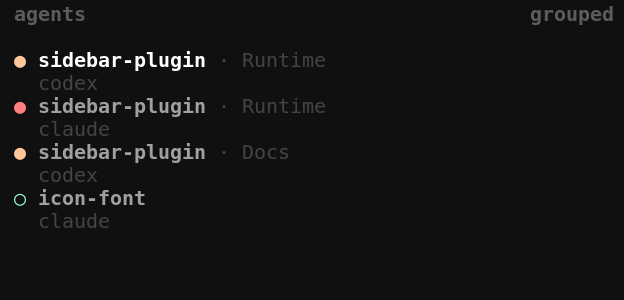
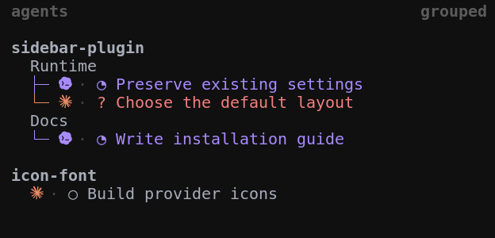
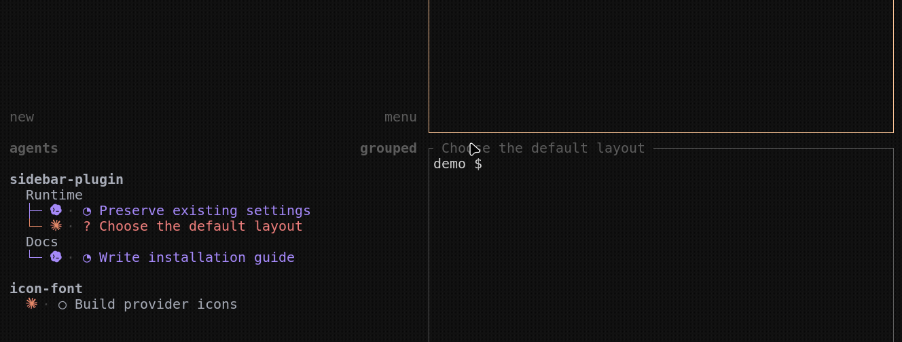

# Herdr Agent Sidebar

**See what each agent is doing, grouped by workspace and tab.**

Turn [Herdr](https://herdr.dev)'s Agents list into a compact task tree, with
readable labels and recognizable provider icons. This customizes the built-in
sidebar; it does not add a file explorer or another pane. **No Herdr fork or build.**

| Before — standard agent rows | After — this preset |
| --- | --- |
|  |  |

*Same four demo agents, same session, theme, and sidebar width. Captured from
Herdr 0.8.2 in Ghostty 1.3.1 on Linux. Titles and states are demonstration data;
the plugin, settings, and terminal rendering are real. [Capture details](docs/demo.md).*

- **Find the right agent.** One-tab workspaces stay compact; multiple tabs get a
  tree. Working groups can move to the top without separating their agents.
- **Read the task.** Uses native conversation titles and local fallbacks—not
  another model call. Quiet workspaces dim after ten minutes by default.
- **Choose the motion.** Keep static status marks, or enable Dots, Orbit, or
  Pulse loaders. Change settings without restarting Herdr.

## Install

Requires **Herdr 0.8.2+**, **Python 3.11+**, and Git. Icon setup targets **Ghostty
on Linux or macOS**. Linux/Ghostty is live-tested; macOS is not yet live-tested.

Run inside a Herdr terminal pane:

```sh
git clone https://github.com/testy-cool/herdr-sidebar-config.git
cd herdr-sidebar-config
python3 setup_sidebar.py install
python3 setup_sidebar.py doctor
```

Open a **fresh Ghostty process** to load the installed icon font, then attach to
your still-running Herdr session. A new tab alone may retain the old font cache.

**Another terminal, or no font changes?** Use `python3 setup_sidebar.py install --text`
instead. Providers use short text labels; no Ghostty restart is needed for a font.
To inspect changes first, add `--dry-run` to the install command.

Setup backs up the files it changes and preserves unrelated Herdr settings.
It replaces the agent-row layout and sets workspace sorting. Keep this checkout:
Herdr links it as the plugin. [Custom paths and manual setup →](docs/setup.md)

## Make it yours

Press **`prefix+,`** or choose **Sidebar settings** in the command palette.
Setup adds the shortcut only when it is free. Use arrows to select and change;
**Enter** saves, **Esc** cancels. Preferences survive updates and removal.

| Setting | Choices |
| --- | --- |
| Order | Workspace order, or active workspace groups first |
| Icons | Automatic, font, or text |
| Dim after | Minutes without a working agent; default 10 |
| Animated loaders | Off by default; On animates working agents only |
| Loader style | Dots · Orbit · Pulse |

<details>
<summary>Watch the settings and loader demo</summary>



The recording uses the same isolated demo session. Animation adds redraws at up
to eight frames per second. Turning it off restores the static indicator and
stops animation wakeups. [How it works and performance caveats →](docs/architecture.md#optional-loaders)

</details>

## What stays the same

Agent status, clicks, and keyboard navigation remain Herdr's own. The tree is
visual grouping, **not collapsible folders**; long labels still clip to the
sidebar width. Titles describe a task, not a generated live summary of every action.

The plugin reads local session metadata and bounded history to find labels. It
does not send prompts, run models, or change agent conversations. No API key,
telemetry, or background network service. Animation is optional; normal label
refreshes are event-driven. [How labels and icons work →](docs/architecture.md)

## Update or remove

Update from this checkout, then reapply the setup:

```sh
git pull --ff-only
python3 setup_sidebar.py install
python3 setup_sidebar.py doctor
```

To remove it and restore the backed-up layout:

```sh
python3 setup_sidebar.py uninstall --dry-run
python3 setup_sidebar.py uninstall
```

Removal keeps your checkout and preferences. Setup refuses to overwrite managed
files edited since installation. [Keeping custom edits and troubleshooting →](docs/setup.md)

Contributing? Start with [AGENTS.md](AGENTS.md) and the [architecture guide](docs/architecture.md).

## Credits and license

Adapted from [moneycaringcoder/herdr-agent-icons](https://github.com/moneycaringcoder/herdr-agent-icons),
with a borderless Codex mark derived from
[qintmb/herdr-icon-agent-ui](https://github.com/qintmb/herdr-icon-agent-ui).
Thanks to [hhdebb/herdr-radar](https://github.com/hhdebb/herdr-radar) for inspiring
the activity-focused improvements and optional loaders. Our loader styles are
implemented here, not copied from Radar.

[MIT license](LICENSE). Provider artwork retains its original terms and
trademarks; see [third-party notices](assets/THIRD_PARTY_NOTICES.md).
Independent community plugin, not an official Herdr or provider product.
